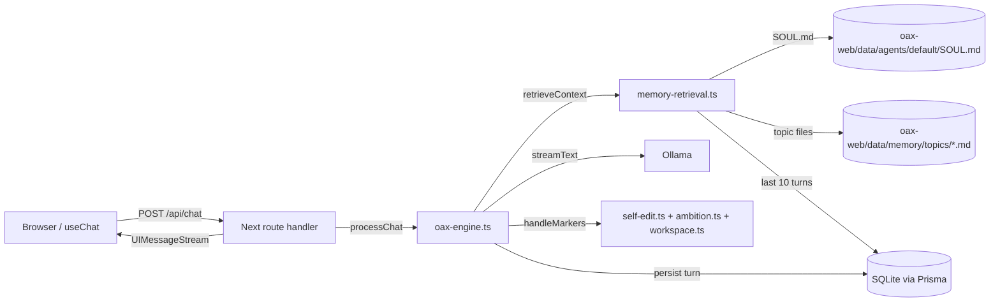
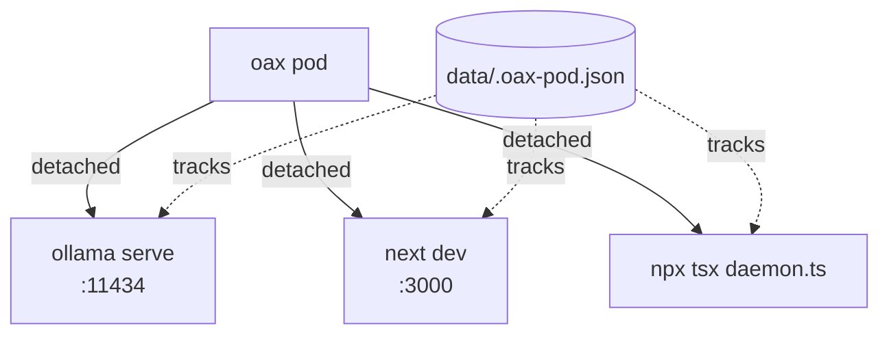

# Architecture

> Public architecture reference for OpenAlfredo. If you're here to
> contribute, this is your map.

OAX is a two-package repo:

- `**/**` (root) — the `oax` CLI wrapper (CommonJS, yargs) that starts the
full stack. Entry: `bin/oax.js`.
- `**/oax-web**` — the actual application: Next.js 14 App Router, Prisma +
SQLite, Ollama provider. All real work happens here.

Run from the right cwd: npm scripts assume `oax-web/` unless stated
otherwise.

---

## Request flow — web chat




Both surfaces — the web UI and the Telegram bot — share **one engine**:
`src/lib/oax-engine.ts`. The engine owns session upsert, context retrieval,
system-prompt construction, marker handling (TASK, SAVE_FILE, READ_FILE,
EDIT_FILE, WRITE_FILE, RESTART_POD), and transcript persistence.

Two entry points:


| Function                                                  | Used by                    | Mode      | SDK call       |
| --------------------------------------------------------- | -------------------------- | --------- | -------------- |
| `processChat(sessionId, userMessage, model)`              | `/api/chat` (web)          | streaming | `streamText`   |
| `processChatSync(sessionId, userMessage, agentId, model)` | `chatWithAgent` (Telegram) | sync      | `generateText` |


Both upsert a `ChatSession`, persist user + assistant `TranscriptEntry` rows,
build the same system prompt, and run the same marker side-effects.

---

## 3-layer memory retrieval

```mermaid
flowchart TD
  Q[user message] --> R[retrieveContext]
  R --> L1[1. SOUL<br/>always loaded]
  R --> L2[2. Topic files<br/>keyword match on tags+title]
  R --> L3[3. Transcripts<br/>last 10 SQLite rows]
  L1 --> S[MemorySlice\[\]]
  L2 --> S
  L3 --> S
  S --> P[system prompt]
```


1. **SOUL** — `oax-web/data/agents/<agentId>/SOUL.md`. Written by the
  onboarding flow. Always prepended.
2. **Topics** — `oax-web/data/memory/topics/*.md`, selected via naive
  keyword match against `oax-web/data/memory/index.json`. Store via
   `saveTopic()`.
3. **Transcripts** — last 10 `TranscriptEntry` rows for the session.

All retrievals log to `oax-web/data/logs/oax-<date>.jsonl` via
`src/lib/logger.ts`.

---

## Daemon cron loops

```mermaid
flowchart LR
  D[daemon.ts] --> TG[Telegram bot<br/>polling]
  D --> CA[AMBITION cron<br/>*/30 * * * *]
  D --> CH[RESTLESS heartbeat<br/>0 * * * *]
  CA -->|dueTasks| A[(data/AMBITION.md)]
  CA -->|NOTIFY| TG
  CH -->|generate| O[Ollama]
  CH -->|[[NOTIFY]] / [[TASK]] / [[REFLECT]] / [[REST]]| L[(data/RESTLESS.log.md)]
  CH -->|[[TASK]]| A
  CH -->|[[NOTIFY]]| TG
```


- **AMBITION cron**: deterministic, no LLM. `dueTasks()` returns tasks whose
`|when:<ISO>` fires inside the last 30 minutes.
- **RESTLESS heartbeat**: LLM-driven. Reads SOUL + AMBITION + last 10
heartbeat entries, emits `[[NOTIFY]]` / `[[TASK]]` / `[[REFLECT]]` /
`[[REST]]` markers.

---

## Pod process tree




`bin/oax.js` spawns all three detached, streams logs (`[ollama] [web] [daemon]` prefixes) to stdout + mirrors to `oax-web/data/logs/pod-*.log`,
and writes a PID manifest to `oax-web/data/.oax-pod.json`. `oax pod stop`
SIGTERMs each process group (then SIGKILL sweep).

---

## Extension points

**Add a new marker** (e.g. `[[EMAIL: …]]`):

1. Write the parser/handler in a new module under `src/lib/`.
2. Import in `oax-engine.ts::handleMarkers()` — parse, side-effect, strip.
3. Document the marker in the system prompt (`buildSystemPrompt()`).
4. Add a test under `src/lib/__tests__/`.

**Add a new memory layer** (e.g. vector embeddings):

1. Extend `MemorySlice.source` union in `memory-retrieval.ts`.
2. Add the retrieval call inside `retrieveContext()`.
3. Log via `logInfo('context_retrieved', …)`.

**Swap the LLM provider** (e.g. OpenAI, local llama.cpp, etc.):

1. `oax-engine.ts` imports from `ai-sdk-ollama`. Replace with another
  provider that exposes a `LanguageModel` compatible with `ai` SDK v6.
2. Update `src/lib/oax.ts::runHeartbeat()` which currently calls
  `ollama.generate` directly.
3. Update `/api/models` route to list models from the new provider.

---

## Self-modification

The agent can mutate its own source via markers in its replies. Scoped to
`REPO_ROOT`. Blocked: `.git/`, `node_modules/`, `.next/`, `data/`,
`oax-web/data/`, `.env`, `.db`/`.sqlite`*.


| Marker                                                            | Shape                                                  |
| ----------------------------------------------------------------- | ------------------------------------------------------ |
| `[[READ_FILE: path]]`                                             | single line                                            |
| `[[EDIT_FILE: path]]\n<old>…</old>\n<new>…</new>\n[[/EDIT_FILE]]` | block; old must match exactly once                     |
| `[[WRITE_FILE: path]]\n…\n[[/WRITE_FILE]]`                        | block; overwrite                                       |
| `[[RESTART_POD]]`                                                 | single line; only honored if a mutating edit succeeded |


On the Telegram (sync) path, a 1-round READ reflex feeds file contents back
and generates the real answer. On the web (streaming) path, READ markers
appear stripped in the reply — the user re-prompts.

---

## Paths — single source of truth

All mutable-state paths live in `oax-web/src/lib/paths.ts`:

```ts
DATA_ROOT            = oax-web/data/
AMBITION_PATH        = data/AMBITION.md
RESTLESS_LOG_PATH    = data/RESTLESS.log.md
AGENTS_DIR           = data/agents/
MEMORY_DIR           = data/memory/
WORKSPACE_DIR        = data/workspace/
LOGS_DIR             = data/logs/
API_KEY_FILE         = data/.oax-api-key
DEFAULT_SOUL_PATH    = data/agents/default/SOUL.md
```

Don't hardcode string literals for state paths. Import from `paths.ts`.

---

## Tests

Vitest under `oax-web/src/lib/__tests__/`. No Ollama required — tests mock
the provider. Run with `npx vitest run`.

---

## Prisma

Schema: `oax-web/prisma/schema.prisma`. Two models: `ChatSession` and
`TranscriptEntry`. SQLite at `oax-web/data/oax.db` via
`DATABASE_URL="file:./data/oax.db"` (relative to `oax-web/`).

Prisma client is a singleton (`src/lib/db.ts`) to avoid connection
exhaustion in Next dev hot-reload.

---

Further reading: `OAX_MVP_PLAN.md` (design intent),
`docs/SELF_MOD_TEST_PROMPTS.md` (tested prompts),
`docs/RESTLESS.md` (heartbeat protocol), `docs/SECURITY.md` (threat model).