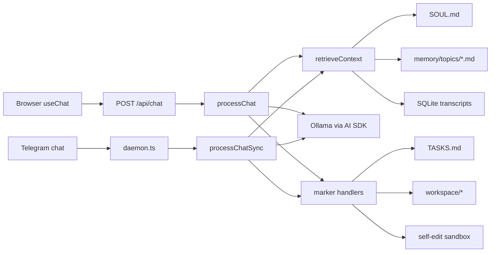

# Architecture

OpenAlfredo is a local-first agent workspace. It combines a root CLI package, a Next.js application package, local SQLite state, Ollama model access, an optional Telegram daemon, and scheduled background loops.

## Overview

The repository has two packages:

- Root package: CommonJS CLI wrapper. The main entry point is `bin/oax.js`.
- `oax-web/`: Next.js 16 App Router application with Prisma/SQLite, Ollama, API routes, UI components, and `daemon.ts`.

Most application work happens in `oax-web/`. Most package scripts should be run from that directory unless a doc explicitly says the command runs from the repo root.

## Major components

| Component | Path | Role |
|---|---|---|
| CLI | `bin/oax.js` | Starts/stops the pod, prints pairing codes, and manages sandbox profiles. |
| Bootstrap | `bin/bootstrap.js` | Creates local runtime state, copies `.env.example`, initializes the database, and writes the local API key. |
| Web UI | `oax-web/src/app/` and `oax-web/src/components/` | Browser chat, tasks, workspace, settings, logs, and reflection panels. |
| API routes | `oax-web/src/app/api/` | Local HTTP interface used by the web UI. |
| Shared chat engine | `oax-web/src/lib/oax-engine.ts` | Web and Telegram chat entry point for memory retrieval, prompt construction, transcript persistence, and marker handling. |
| Telegram daemon | `oax-web/daemon.ts` | Optional Telegram polling plus scheduled loops. |
| Runtime paths | `oax-web/src/lib/paths.ts` | Single source of truth for mutable state paths. |
| Database | `oax-web/prisma/schema.prisma` | SQLite-backed `ChatSession` and `TranscriptEntry` models. |

## Data flow



Both chat surfaces share the same engine:

- `processChat(sessionId, userMessage, model)` streams web responses.
- `processChatSync(sessionId, userMessage, agentId, model)` returns non-streaming Telegram responses.

Both paths upsert a `ChatSession`, write user and assistant `TranscriptEntry` rows, retrieve memory, build the system prompt, and run marker side effects.

## Memory model

OpenAlfredo uses three memory layers:

1. SOUL: `oax-web/data/agents/<agentId>/SOUL.md`, loaded when present.
2. Topic files: `oax-web/data/memory/topics/*.md`, selected through keyword matches against `oax-web/data/memory/index.json`.
3. Transcripts: the latest 10 SQLite transcript rows for the active session.

`retrieveContext()` logs retrievals to `oax-web/data/logs/oax-<date>.jsonl`.

## Runtime state

Mutable state lives under `oax-web/data/` by default:

```text
oax-web/data/
  agents/default/SOUL.md
  AMBITION.md
  TASKS.md
  RESTLESS.log.md
  memory/
  workspace/
  logs/
  oax.db
```

The root `SOUL.md`, `AMBITION.md`, `RESTLESS.md`, `memory/`, and `data/` paths are legacy pre-unification state. Current docs should point to `oax-web/data/` unless they explicitly discuss legacy fallback behavior.

## Background loops

The daemon owns four recurring loops:

| Loop | Default schedule | Purpose |
|---|---:|---|
| Deterministic task scan | `*/30 * * * *` | Sends due `TASKS.md` reminders. |
| RESTLESS heartbeat | `0 * * * *` | Asks the model whether to notify, create a task, reflect, or rest. |
| AMBITION reflection | `0 7 * * *` | Generates the morning reflective brief. |
| Continuity loop | `0 10,16 * * *` | Extracts themes and creates follow-up tasks, stickies, or files. |

Schedule values come from `oax-web/.env` and are validated by `oax-web/src/lib/runtime-settings.ts`.

## External dependencies

- Node.js 20+ for local runtime.
- npm for dependency installation and scripts.
- Ollama on `localhost:11434` for local models.
- Telegram Bot API only when `TELEGRAM_TOKEN` is configured.
- SQLite through Prisma for local transcript persistence.

## Design decisions

- Local-first by default. Runtime state and secrets stay on the operator's machine.
- One shared engine for web and Telegram chat behavior.
- Markdown files hold operator-readable state such as SOUL, TASKS, AMBITION, and workspace artifacts.
- SQLite holds chat sessions and transcripts.
- Runtime paths are centralized in `src/lib/paths.ts`.
- Self-modification is marker-based and constrained by a path blocklist.
- Sandbox profiles are web-only and isolated from the personal profile.

## Extension points

Add a new marker by writing a parser/handler under `oax-web/src/lib/`, importing it into `handleMarkers()` in `oax-engine.ts`, documenting it in the system prompt, and adding tests under `oax-web/src/lib/__tests__/`.

Add a new memory layer by extending `MemorySlice.source`, adding retrieval inside `retrieveContext()`, logging via `logInfo('context_retrieved', ...)`, and adding hit/miss/error tests.

Swap the model provider by replacing the `ai-sdk-ollama` provider path in `oax-engine.ts`, updating the direct Ollama heartbeat call in `oax.ts`, and changing `/api/models` to list models from the new provider.

## Unresolved questions

- Whether the local API key model should ever support network-exposed or multi-user deployments.
- Whether the root-level legacy fallback state should be removed once all installs use `oax-web/data/`.
